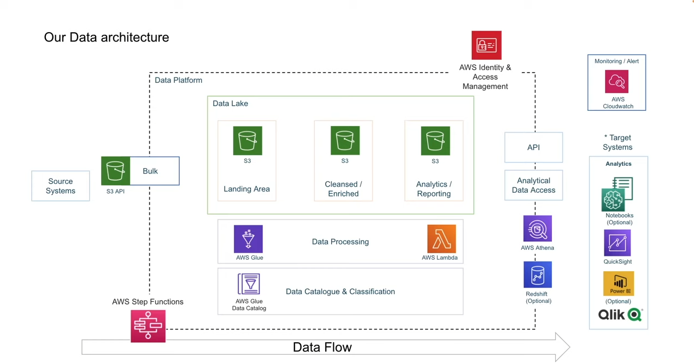
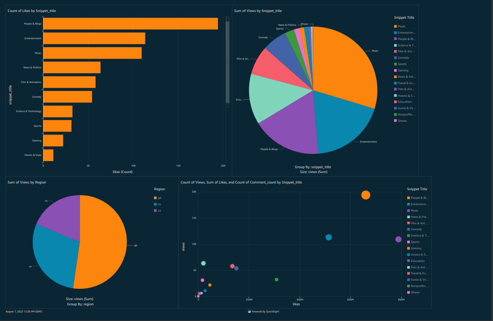

# Youtube-data-analysis

An End to End Data Engineering Project created for learning purpose by following [Darshil's Tutorial](https://youtu.be/yZKJFKu49Dk)

Useful links - 
1. Create Your [AWS Account](https://www.youtube.com/redirect?event=video_description&redir_token=QUFFLUhqbWlMN3Z0OXQwNE9oRzFXUXF0di1LYnZ0c1M4d3xBQ3Jtc0ttTWp4Y1oxT21RNE5VNjBUVXBGZmVncXBQSFgtR1Ezajk2dDBTc0JPQnRvOEV0ampTcTZTVGZRcllrVlVXc3RDQVNwSDVuWkpiczl1S1lnT3NtdXMzM2t4RGhYeFhEUTNUZ1N5N1pBUE1NR1gyTTJIaw&q=https%3A%2F%2Faws.amazon.com%2Fpremiumsupport%2Fknowledge-center%2Fcreate-and-activate-aws-account%2F&v=yZKJFKu49Dk)
2. Download [AWS CLI](https://www.youtube.com/redirect?event=video_description&redir_token=QUFFLUhqblpIZFdkRHo5QXlFc1ZXd0l6THNpN09HTVRQd3xBQ3Jtc0ttQ1UzSTF2WUdja3JrTmt2LVR5aTN3d1o0dEpxd3VVdnJfNmxPc2tkYURoaXhsOTFnZ3dDNFlySk5lT1hheGViMEVVcWk3cGsxNDdrb19oWGhHSU1rSG9MbzgwZnNrY3lYMzFnbUhkZUFKTEVEQi1jdw&q=https%3A%2F%2Faws.amazon.com%2Fcli%2F&v=yZKJFKu49Dk)
3. Download Data From [Here](https://www.youtube.com/redirect?event=video_description&redir_token=QUFFLUhqbTM3WDg0Y3JVajlBRVl6Q3oxSldNaWY2ZDdJQXxBQ3Jtc0tuNjd6SWJhTXpvREgzUzl0M2V5a1NoWXZQX09FcUZ2Y2kzWlBHR3RBWnVxbi1TdTdWdzZiVURNYlJWUTU5QVpuWWRsZ1Z6allFWk9ic05wd2tzbmdNMWtORjJub1BJN3hFQldwQ0kta0lLV0ZhYnhLSQ&q=https%3A%2F%2Fwww.kaggle.com%2Fdatasnaek%2Fyoutube-new&v=yZKJFKu49Dk)

## AWS Tools Used

- Glue
- Lambda
- Glue crawler
- Athena
- IAM Roles
- AWS Quicksight

## Architecture

## Final Dashboard View

